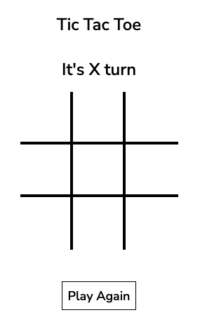
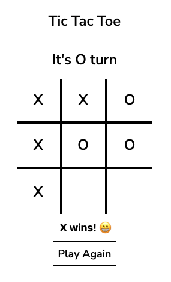
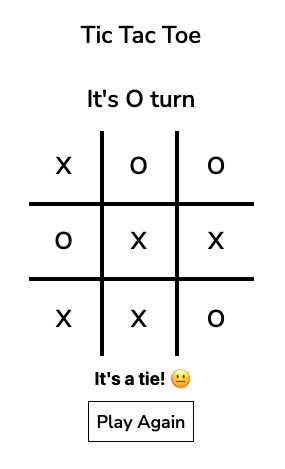

<h1><i>Tic Tac Toe</h1>
<h5>SEI 48 Project 0<h5>

<a href="https://github.com/JP4441/GA_Project_0_TicTacToe/issues">Report Bug</a>

<h4>This is the first small/medium coding project I worked on. This game is the result of several days of studying different people's code and trying to improve upon the coding design to make as clean DRY possible.<h4>

# Details:

- Type of website: Static.
- Time of completion: 3 days.
- Started last day of week 1 during bootcamp.

# Features:

- Desktop and Mobile compatible.
- Simple tic tac toe game for 2 players in one screen. It computes winner and when it's a tie.

# Technologies Used

- Java Script
- HTML
- CSS

# You can test this game by clicking [**HERE**](https://tictactoe.joseserrano6.repl.co/)

# Images

|         Main Screen         |         Play X Wins         |
| :-------------------------: | :-------------------------: |
|  |  |

|         It's a Tie!         |
| :-------------------------: |
|  |
